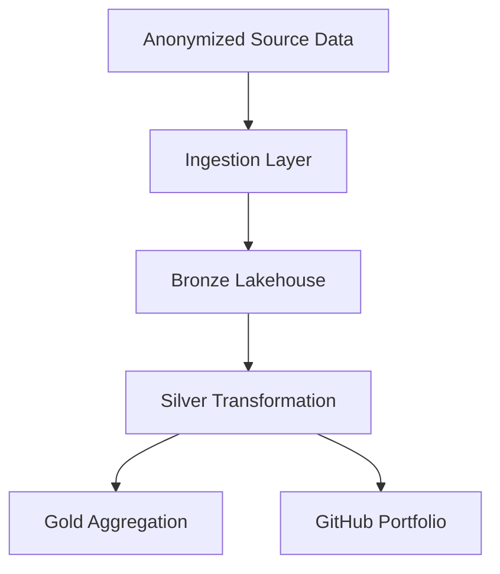

# End-to-End Retail Analytics Platform
 
End-to-end data engineering solution built on Microsoft Fabric, implementing a medallion architecture for retail analytics.
 
## Project Overview
 
This project demonstrates an end-to-end retail analytics pipeline using Microsoft Fabric.  
It ingests anonymized source data, transforms it through Bronze, Silver, and Gold layers, and prepares the data for reporting in Power BI.
 
## Architecture
 

## Technologies

-- Microsoft Fabric Data Factory.
-- Fabric Lakehouse.
-- PySpark Fabric Notebooks.
-- Delta Lake.
-- Python.

## Data Flow

1. Source data is ingested into the Bronze layer.
2. Data is cleaned, standardized, and anonymized in the Silver layer.
3. Business rules and aggregations are applied in the Gold layer.
4. Final curated tables are used for dashboards and reporting.

## Key Features
 
- Medallion architecture implementation.
- Automated data ingestion.
- Data cleansing and transformation.
- PII anonymization.
- Analytics-ready Gold tables.
- Portfolio-ready documentation.

## Repository Structure
 
- `notebooks/` - Fabric notebooks for ingestion and transformation.
- `data/` - Sample anonymized source data.
- `docs/` - Architecture notes and supporting documentation.
- `screenshots/` - Pipeline and dashboard images.
- `README.md` - Project documentation.

## Prerequisites

Microsoft Fabric workspace.
Lakehouse.
Sample dataset.

## How to Run This Project

Create a Fabric workspace.
Create a Lakehouse.
Upload the source data to the Bronze layer.
Run the notebook to transform data into Silver and Gold tables.
Connect Power BI to the Gold layer for reporting.

## Lessons Learned

How to design a medallion architecture in Microsoft Fabric.
How to ingest and transform data using notebooks and Dataflow Gen2.
How to structure a portfolio-ready data engineering project.
How to prepare curated analytics tables for BI reporting.

## Contact
Your Name
LinkedIn: Your LinkedIn
GitHub: Your GitHub

